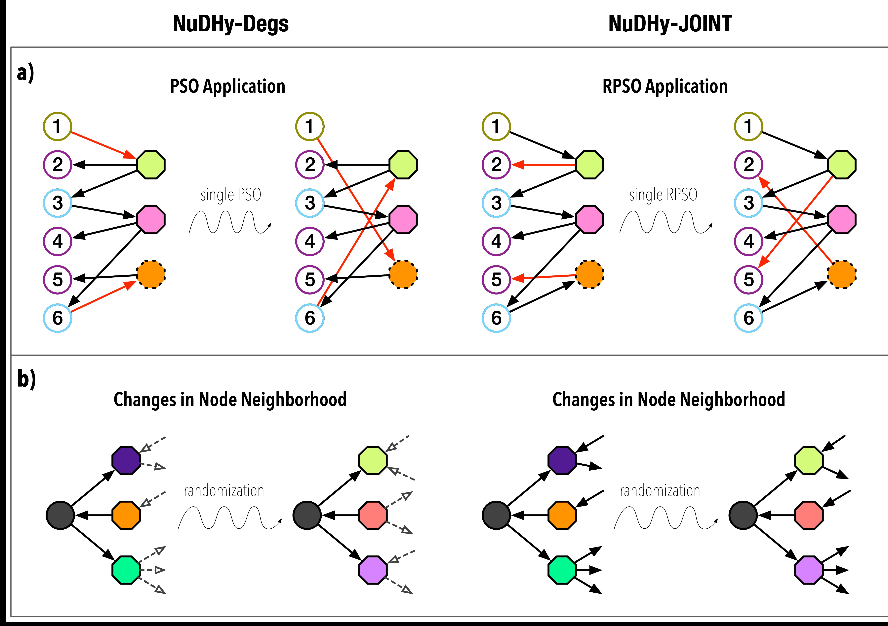

# NuDHy

## Overview

This package includes NuDHy, a suite of Markov-Chain Monte-Carlo algorithms for sampling directed hypergraphs from two novel null models, based on a carefully defined set of states and efficient operations to move between them. 
The first null model preserves the left and right in- and out-degree sequences of the bipartite graph corresponding to the directed hypergraph.
The corresponding sampler, NuDHy-Degs, is based on Parity Swap Operations (PSOs), which preserve the degree sequences.
The second null model preserves the bipartite Joint Out-IN degree Tensor (JOINT) of the bipartite graph corresponding to the directed hypergraph. Preserving the JOINT automatically preserves the degree sequences.
The corresponding sampler, NuDHy-JOINT, is based on Restricted Parity Swap Operations (RPSOs), which preserve the JOINT.
We also included a naive sampler, called UnpretentiousNullModel, that generates random hypergraphs with the same head-size and tail-size distributions of the observed hypergraph.

The package includes a Jupyter Notebook (Charts.ipynb) with the complete experimental evaluation of NuDHy. 

## Content

    code/            ... Java source files of the samplers
    data/            ... datasets used in the experimental evaluation
    helpers/         ... Python and Bash scripts to compute hypergraph metrics of interest 
    run.sh           ... Bash script for running the Java code
    config.cfg       ... configuration file for the Java code
    requirements.txt ... Python libraries required to run the scripts in helpers
    Charts.ipynb     ... Jupyter Notebook with the results of the experimental evaluation

The folder **helpers** includes the Python and Bash scripts used to calculate the metrics presented in the charts in the Jupyter Notebook *Charts.ipynb*. 

## Requirements

To run the Java code (the source files are in the folder *code*), you need *Java JRE v1.8.0*.
To run the Python scripts and check the results of our experimental evaluation, you must install the libraries listed in the file *requirements.txt*.
To run the non-linear contagion simulations, you also need the *gcm* library available [HERE](https://github.com/gstonge/gcm/tree/c5d1f0860f7e921ed191a96f7859b232547092d2) and the *schon* library available [HERE](https://github.com/gstonge/schon/tree/79e568ec846697383143ba01ef69572f66e61552).

## Input Format

The input file for undirected hypergraphs must be a comma separated list of integers, where each integer represents a node and each line represents a hyperedge. 
Each line of the input file for directed hypergraphs consists of a tab-separated sequence of comma-separated list of integers, where the first element of each sequence corresponds to the head of a hyperedge, and the second element corresponds to its tail.

All the scripts assume that the file extension is .tsv. The folder *data* includes all the datasets used in our experimental evaluation of NuDHy.
All but the following files represent directed hypergraphs:
 - lyon.tsv
 - high.tsv
 - email-Enron.tsv
 - email-Eu.tsv

## How to Use the Samplers

Once you have built the project (with dependencies) and generated the *jar* file, you can use NuDHy-Degs, NuDHy-JOINT, and UnpretentiousNullModel by running the script *run.sh* included in this package. 
The value of each parameter used by NuDHy and UnpretentiousNullModel must be set in the configuration file *config.cfg*.
The configuration file assumes that the name of the *jar* file is *NUDHY.jar*.

### General Settings

 - *datasetsDir*: directory where the input files are placed
 - *resultsDir*: directory where the output files will be stored
 - *seed*: seed for reproducibility.
 - *numThreads*: number of threads for parallel computation.
 - *maxNumSwapsFactor*: integer used in the Convergence experiment.
 - *headTailDisjoint*: whether the head and tail of each hyperedge must be disjoint when generating a random hypergraph using UnpretentiousNullModel.
 - *k*: number of frequent itemsets to return in the Convergence experiment.
 - *size*: min size of a frequent itemset to return in the Convergence experiment.
 - *samplerType*: name of the sampler to use (values admissible are "NuDHy\_Degs", "NuDHy\_JOINT", and "UnpretentiousNullModel").
 - *store*: whether the samples generated must be stored on disk.

### Dataset-related Settings

 - Dataset names: names of the dataset files.
 - Default values: comma-separated list of default values for each dataset, i.e., number of swaps to perform before returning the random sample, and number of random samples to generate.
 - Minimum frequency thresholds: minimum frequency thresholds used to return the top-*k* frequent itemsets of size greater than *size* in the Convergence experiment.
 - Experimental flags: test to perform among (1) convergence (*ConvergenceFI.java*), (2) Structural Entropy (*StructuralEntropy.java*), (3) scalability (*Scalability.java*), and (4) generation of random samples (*Sampling.java*). Then, the arrays that store the names, the default values, the frequency thresholds, and the experimental flags of each dataset to test must be declared at the beginning of the script *run.sh*.

## How to Compute the Metrics

The folder *helpers* includes the code to compute the following metrics:

- **Reciprocity**
   * *hyprec*: folder with the source code provided by the authors of [1] to compute the reciprocity of directed hypergraphs.
   * *run\_reciprocity*: script to call the methods in *hyprec* for all the samples in parallel.
 - **Hyper-coreness**
   * *coreness*: methods to compute the *m*-shell indices of the vertices.
   * *run\_coreness*: script to call the methods in *coreness* for all the samples in parallel.
   * *compute\_hypercoreness*: script to compute the hyper-coreness of the vertices, once found their *m*-shell indices.
- **Multi-order Laplacian**
   * *laplacian*: methods to generate the multi-order Laplacian and extract its smallest/largest eigenvalues.
   * *run\_laplacian*: script to call the methods in *laplacian* for all the samples in parallel.
- **Node Centrality**
   * *centrality*: methods to compute the Hub, Authority, and PageRank score of each vertex.
   * *run\_centrality*: script to call the methods in *centrality* for all the samples in parallel.
- **Economic Complexity**
  * *run\_ec\_indices*: methods to compute the GENEPY, ECI, and Fitness of each country in a trade network.
  * *run\_eco\_complexity\_experiment*: scripts to call the methods in *run\ec\_indices* for each trade network and each sample.
 - **Group Affinity**
   * *run\_affinity*: methods to compute the group affinity and homophily of each vertex label.
   * *run\_affinity\_experiment*: script to call the methods in *run\_affinity* for each Congress network and each sample.
 - **Non-linear Contagion**
   * *run\_non\_linear\_contagion*: methods to simulate a (non)-linear contagion process in an undirected hypergraph.
   * *influential-groups*: methods provided by the authors of [2] to pre-process an undirected hypergraph and compute the output of the corresponding AMEs.
   * *run\_contagion\_experiment*: script to call the methods in *run\_non\_linear\_contagion* for each contact network and each sample.

The folder includes also:
  - *config*: configuration files to set the value of each relevant parameter.
  - *io*: methods to read the data from disk in various formats.
  - *parser\_for\_output\_file\_names*: methods to parse the file names of the samples and extract relevant information about the sampling process.
  - *utils*: some useful methods.
  - *generate\_samples\_redi*: script to generate random directed hypergraphs according to the null models proposed in [1].

To conveniently run the scripts *run\_reciprocity*, *run\_coreness*, *run\_laplacian*, *run\_centrality*, and *compute\_hypercoreness*, for each dataset and sampler of interest, you can use the Bash script *run\_all\_metrics\_experiment*.
To run each of them separately, you must provide as arguments the dataset name and the sampler name. The sampler names available are:
  - 'NuDHy': metrics will be computed for both the samples generated by NuDHy-Degs and NuDHy-JOINT.
  - 'Base': version of ReDi where .
  - 'BaseD': version of ReDi-degreewise where .
  - 'ReDi': ReDi.
  - 'ReDiD': ReDi-degreewise.
  - 'UnpretentiousNullModel': naive sampler that preserves the head-size and tail-size distributions.
More details on the ReDi variants can be found in the original paper [1].
All the other parameters must be specified in the *config* file.
For example, to compute the node centrality for the nodes in the samples generated by NuDHy for the dataset *enron* you must run use the following command:

`python run_centrality.py enron NuDHy`

To be able to run the scripts listed above, you first need to generate some random samples using the chosen sampler.
The samples generated must be placed in a zip folder with the name of the chosen dataset.
The zip folder must be placed in a directory with the name of the chosen sampler.

For example, if you generated some samples using NuDHy-Degs or NuDHy-JOINT starting from the observed dataset *enron*, you must place the samples at the following path:

`sample_path/NuDHy/enron.zip`

where *sample\_path* is a parameter that can be set in the *config* file.

## License
This package is released under the GNU General Public License.

## References
[1] Kim, Sunwoo, et al. "Reciprocity in directed hypergraphs: measures, findings, and generators." Data Mining and Knowledge Discovery 37.6 (2023): 2330-2388.

[2] St-Onge, G., Iacopini, I., Latora, V. et al. Influential groups for seeding and sustaining nonlinear contagion in heterogeneous hypergraphs. Commun Phys 5, 25 (2022).
